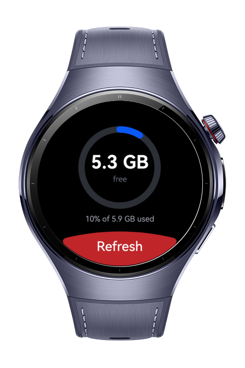
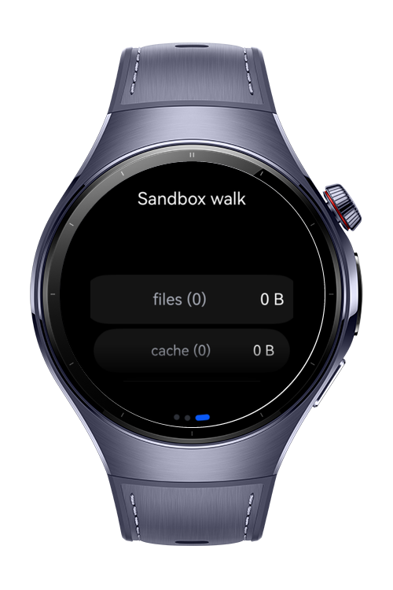
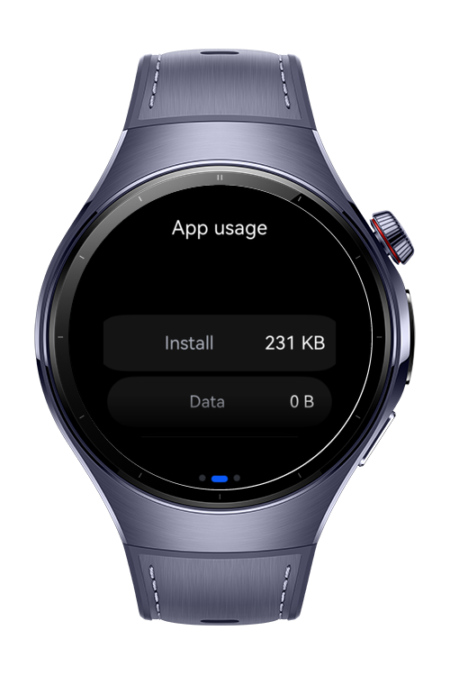

> **Note:** To access all shared projects, get information about environment setup, and view other guides, please visit [Explore-In-HMOS-Wearable Index](https://github.com/Explore-In-HMOS-Wearable/hmos-index).

# How to monitor device storage

Device Storage is a codelab project demonstrating key storage management APIs: device total and free space, per-bundle storage statistics, recursive sandbox directory sizing, and human-readable byte formatting on a wearable screen.

# Preview

<div>
  
  
  
</div>

# Use Cases

- Read device total, used and free space with `statfs`.
- Query the current app's install, data and cache footprint with `storageStatistics`.
- Walk the application sandbox recursively to size each directory.
- Format raw byte counts and usage percentages for a watch-sized readout.
- Browse the results as paged cards driven by the digital crown.

# Technology

## Stack

- **Languages**: ArkTS, ArkUI
- **Frameworks**: HarmonyOS 6.0.1 (API 21)
- **Tools**: DevEco Studio 6.0.1
- **Libraries**:
    - `@kit.ArkUI`
    - `@kit.AbilityKit`
    - `@kit.CoreFileKit`
    - `@kit.BasicServicesKit`
    - `@kit.PerformanceAnalysisKit`
    - `@ohos.file.statvfs`
    - `@ohos.file.storageStatistics`
    - `@ohos.file.fs`

## Required Permissions

- None. Querying the current bundle's statistics and the app sandbox requires no permission declaration.

> `storageStatistics.getCurrentBundleStats()` depends on `SystemCapability.FileManagement.StorageService.SpatialStatistics`, which is not present on every device. The call is guarded with `canIUse` and the App card renders `--` when it is missing.

> The same rule applies to the Device card: when `statfs` fails, the ring reads `--` rather than `0 B`, and the failure message is shown under it. A root whose walk could not be completed is marked with a trailing `*` on the Sandbox card.

# Directory Structure

```
entry/
├── src/main/
├── src/main/ets/
│ ├── common/
│ │ ├── BundleStorage.ets
│ │ ├── ByteFormatter.ets
│ │ ├── DeviceStorage.ets
│ │ ├── DirectorySizer.ets
│ │ ├── SafeAreaUtil.ets
│ │ └── WearTheme.ets
│ │
│ ├── entryability/
│ │ └── EntryAbility.ets
│ │
│ ├── entrybackupability/
│ │ └── EntryBackupAbility.ets
│ │
│ ├── model/
│ │ └── StorageModels.ets
│ │
│ ├── viewmodel/
│ │ └── StorageViewModel.ets
│ │
│ ├── view/
│ │ └── MetricRow.ets
│ │
│ └── pages/
│   └── Index.ets
│
├── src/test/                 local unit tests (ByteFormatter, host-only)
└── src/ohosTest/             on-device tests (statfs, storageStatistics, sandbox walk)
```

# Tests

| Suite | Runs on | Covers |
| --- | --- | --- |
| `entry/src/test` | Host | `ByteFormatter` - unit boundaries, precision clamping, invalid input. Pure, so no device needed. |
| `entry/src/ohosTest` | Device | `DeviceStorage`, `BundleStorage`, `DirectorySizer`, `StorageViewModel` against a real file system. |

The on-device suite writes a fixed-size probe file into `filesDir` in `beforeAll` and removes it in
`afterAll`, so the walk has a known quantity to find rather than depending on whatever the app left
behind. Assertions are invariants, not fixed numbers - free space on a watch is whatever it is, but
`used + free == total` holds everywhere, and the recursive walk and the flat `listFile` walk must
agree with each other.

# Constraints and Restrictions

## Supported Devices

- Huawei Watch 5

# License

**Device Storage** is distributed under the terms of the MIT License

See the [LICENSE](./LICENSE) for more information.
